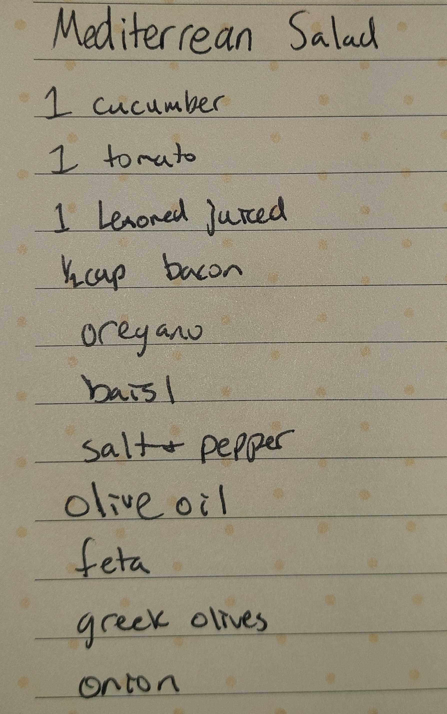

Your task is to convert the image provided into a simple recipe in html format. This recipe should have the most basic style and structure leveraging the bootstrap framework. The resulting .html should be located right next to the image in the same directory.

# Instructions
- If an image is not pasted in the context let the user know you need an image pasted to in the context to proceed
- You need a relative path to the image file
    a. Test the image file is reachable with `[ -f "<image-file>" ] && echo "Exists" || echo "Does not exist"`
- extract the recipe from the pasted image information
- Prompt the user to review and update the extracted recipe information if necessary
- Once the user confirms the recipe information is correct, generate a simple HTML file using the bootstrap framework
- With the html file generated, git add both the path to the image file and the generated HTML
    - run command `git add <image-file> <html-file>`
- Run the following prompt [regenerate-nav.prompt.md](regenerate-nav.prompt.md) to update the navigation of the site.
# Example

Here is an example image


Here is what the extracted recipe looks like

```md
Title: Mediterranean Salad

Ingredients:

1 cucumber
1 tomato
1 lemon, juiced
½ cup bacon
oregano
basil
salt & pepper
olive oil
feta
greek olives
onion
```

Here is what the resulting .html looks like

```html
<!DOCTYPE html>
<html lang="en">
<head>
    <meta charset="UTF-8">
    <meta name="viewport" content="width=device-width, initial-scale=1.0">
    <title>Mediterranean Salad Recipe</title>
    <!-- Bootstrap CSS -->
    <link href="https://cdn.jsdelivr.net/npm/bootstrap@5.3.2/dist/css/bootstrap.min.css" rel="stylesheet">
</head>
<body class="bg-light">
    <div class="container py-5">
        <div class="row justify-content-center">
            <div class="col-md-8 col-lg-6">
                <div class="card shadow-sm">
                    <div class="card-body">
                        <h1 class="card-title text-center mb-4">Mediterranean Salad</h1>
                        <h5>Ingredients</h5>
                        <ul>
                            <li>1 cucumber</li>
                            <li>1 tomato</li>
                            <li>1 lemon, juiced</li>
                            <li>½ cup bacon</li>
                            <li>oregano</li>
                            <li>basil</li>
                            <li>salt & pepper</li>
                            <li>olive oil</li>
                            <li>feta</li>
                            <li>greek olives</li>
                            <li>onion</li>
                        </ul>
                        <h5>Instructions</h5>
                        <ol>
                            <li>Chop the cucumber, tomato, and onion.</li>
                            <li>Combine all vegetables in a large bowl.</li>
                            <li>Add bacon, feta, and greek olives.</li>
                            <li>Drizzle with olive oil and lemon juice.</li>
                            <li>Season with oregano, basil, salt, and pepper to taste.</li>
                            <li>Toss gently and serve chilled.</li>
                        </ol>
                    </div>
                    <div class="text-center pb-4">
                        
                    </div>
                </div>
            </div>
        </div>
    </div>
</body>
</html>
```

## Bootstrap
Use the same CDN link for bootstrap that is found in #file:`src/index.html`
